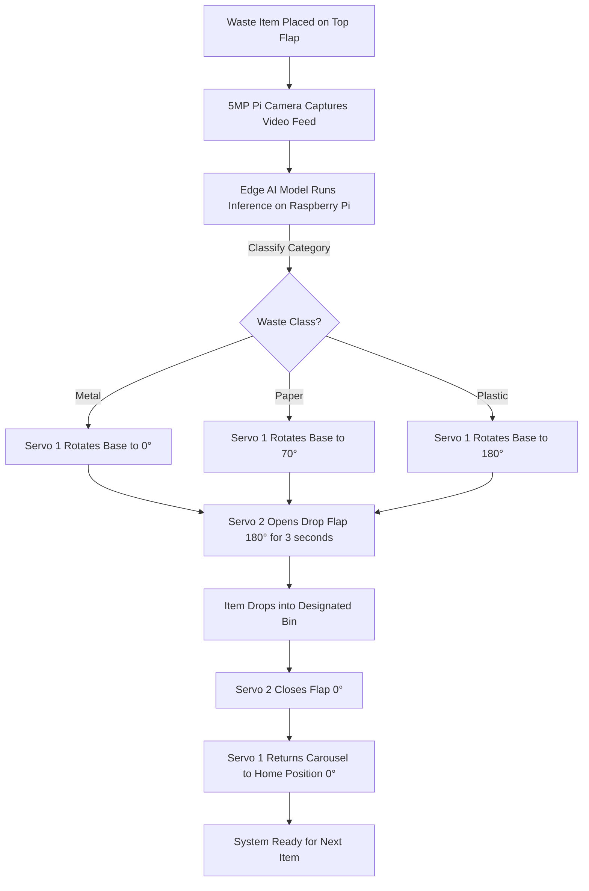

# ♻️ AI-Powered Smart Video Classifying Recycle Bin

[](https://www.raspberrypi.com/)
[](https://developers.google.com/mediapipe)
[](https://python.org)
[](https://thonny.org)
[](LICENSE)

An intelligent, automated waste sorting system built on **Raspberry Pi 4 / 5 Model B**. It captures real-time video of discarded waste items via a **5MP Pi Camera**, detects and classifies the material type (**Metal, Paper, Plastic**) using an **Edge AI Object Detection Model** (trained with Google Colab & TensorFlow Lite), and mechanically sorts the waste into segregated bins using dual high-torque **MG996R servo motors**.

---

## 📹 Hardware Demonstration


> 🎥 **Full Video Demo**: Watch the full prototype video in [assets/demo.mp4](assets/demo.mp4).

---

## 🛠️ Hardware Photos & Mechanical Design

| Complete Prototype | PVC Frame Structure |
| :---: | :---: |
|  |  |
| **Real Hardware Prototype in Action** | **Rigid PVC Pipe Framework** |

| Inverted Prism Guide Chute | Electronics & Servo Bench |
| :---: | :---: |
|  |  |
| **PVC Foam Chute & Acrylic Top Lid** | **Raspberry Pi 4 + Dual MG996R Servos** |

| Plastic Sorting Action | 3D CAD Structure Design |
| :---: | :---: |
|  |  |
| **Carousel Rotated to Plastic Compartment** | **3D Structure Render** |

---

## ⚙️ How It Works



1. **Vision Sensing**: When an item is placed on the chute, the **Pi Camera** sends video frames to the Raspberry Pi.
2. **AI Classification**: The **TensorFlow / MediaPipe** model running locally on the Raspberry Pi identifies the object (`metal`, `paper`, or `plastic`).
3. **Carousel Positioning (Servo 1 - GPIO 18)**:
   - `Metal` $\rightarrow$ **0°**
   - `Paper` $\rightarrow$ **70°**
   - `Plastic` $\rightarrow$ **180°**
4. **Dispense Actuation (Servo 2 - GPIO 19)**: The drop flap rotates to **180°** to drop the item into the selected compartment, holds for 3 seconds, and returns to **0°** (closed).
5. **Reset Sequence**: The carousel returns to its home position (`0°`), ready for the next waste item.

---

## 🔌 Circuit Wiring & GPIO Connections


### GPIO Pinout Table

| Component | Pin / Wire | Connected To (Raspberry Pi / PSU) | Description |
| :--- | :--- | :--- | :--- |
| **Servo 1 (Base Carousel)** | Orange (PWM Signal) | **GPIO 18 (Pin 12 / PWM0)** | Rotates compartment base |
| **Servo 1 (Base Carousel)** | Red (VCC) | **External 5V / 6V DC (+)** | High-torque power rail |
| **Servo 1 (Base Carousel)** | Brown (GND) | **External DC (-) & Pi GND** | Common Ground |
| **Servo 2 (Drop Flap)** | Orange (PWM Signal) | **GPIO 19 (Pin 35 / PWM1)** | Opens and closes drop flap |
| **Servo 2 (Drop Flap)** | Red (VCC) | **External 5V / 6V DC (+)** | High-torque power rail |
| **Servo 2 (Drop Flap)** | Brown (GND) | **External DC (-) & Pi GND** | Common Ground |
| **Raspberry Pi Ground** | Ground (GND) | **Pin 6 / 9 / 14 / 39 (GND)** | Connected to External PSU Ground |
| **Pi Camera** | CSI Ribbon Cable | **CSI Port** | 5MP OV5647 Video Stream |

> ⚠️ **Important:** Connect a common ground wire between the Raspberry Pi GND pin and the external servo power supply GND terminal. Do **not** power the MG996R servos directly from the Raspberry Pi 5V pin header to prevent power brownouts.

---

## 🧠 Model Training on Google Colab

The AI model was trained using **Google Colab**, **TensorFlow**, and **MediaPipe Model Maker** using the [Garbage Classification / TrashNet Dataset](https://github.com/garythung/trashnet).

To view or retrain the model, open the Jupyter Notebook:
👉 [`notebooks/Waste_Classification_Training_Colab.ipynb`](notebooks/Waste_Classification_Training_Colab.ipynb)

### Training Workflow:
1. Load dataset partitioned into **Metal**, **Paper**, and **Plastic**.
2. Apply data augmentations (rotation, flip, brightness variation).
3. Train using transfer learning on **MobileNetV2 / EfficientDet-Lite**.
4. Quantize and export the model as `best.tflite` for edge deployment on Raspberry Pi.

---

## 🚀 How to Run on Raspberry Pi

### 1. Clone the Repository
```bash
git clone https://github.com/<your-username>/ai-recycle-bin.git
cd ai-recycle-bin
```

### 2. Install Dependencies
```bash
pip install -r requirements.txt
```

### 3. Run Using Thonny IDE
1. Open **Thonny IDE** on your Raspberry Pi.
2. Open [`main.py`](main.py).
3. Click the **Run Current Script (F5)** button.

### 4. Or Run via Terminal
```bash
python main.py --model best.tflite
```

### 5. Testing on PC / Laptop (Simulation Mode)
You can also test the script on your laptop using a test video or webcam:
```bash
python main.py --video assets/demo.mp4
```

---

## 💰 Bill of Materials (BOM) & Cost Breakdown

| Component | Specification | Quantity | Cost (INR) |
| :--- | :--- | :---: | :--- |
| **Raspberry Pi 4 Model B** | 4GB RAM Single Board Computer | 1 | ₹3,400 |
| **Pi Camera Module** | 5MP OV5647 CSI Camera | 1 | ₹300 |
| **SD Card** | 32GB Class 10 MicroSD | 1 | ₹400 |
| **Raspberry Pi Power Adapter** | Official 15W USB-C (5.1V / 3A) | 1 | ₹725 |
| **External DC Power Supply** | 5V / 6V / 9V (Regulated for Servos) | 1 | ₹1,000 |
| **Servo Motors (MG 996R)** | High-Torque Metal Gear Digital Servos | 2 | ₹900 |
| **PVC Pipes & Joints** | Rigid Outer Structure Framework | - | ₹650 |
| **Acrylic & PVC Foam Sheets** | Chute, Top Cover, and Rotating Disc | - | ₹990 |
| **Castor Wheels, Cables & Misc** | Magnets, Jumper Wires, Paint, Fasteners | - | ₹3,635 |
| **Total Estimated Cost** | | | **~₹12,000 INR** |

For the complete itemized breakdown, see [`docs/bill_of_materials.md`](docs/bill_of_materials.md).

---

## 📄 Project Documentation

The full 55-page formal project report detailing literature survey, hardware design, code explanations, testing, and challenges is available at:
📁 [`docs/AI_Recycle_Bin_Project_Report.pdf`](docs/AI_Recycle_Bin_Project_Report.pdf)

---

## 📜 License

This project is licensed under the [MIT License](LICENSE).
