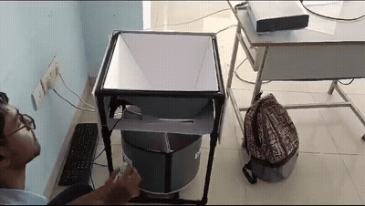
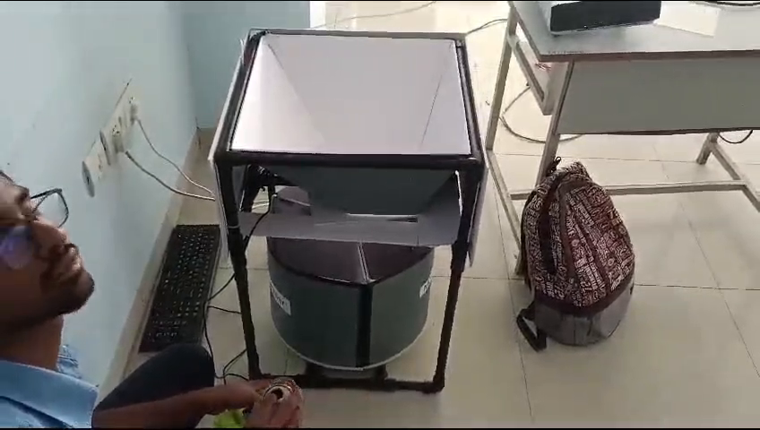
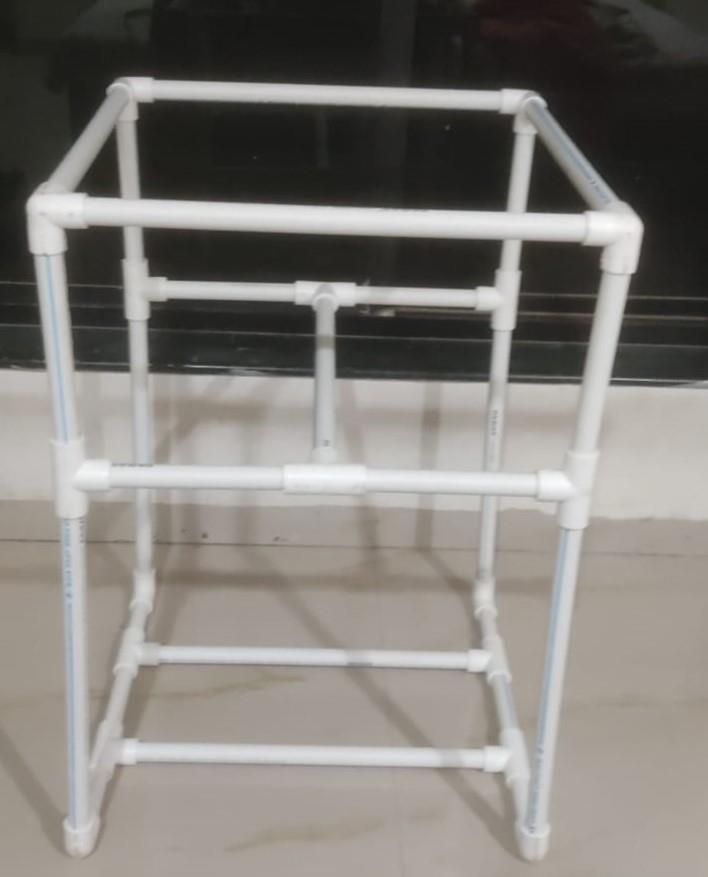
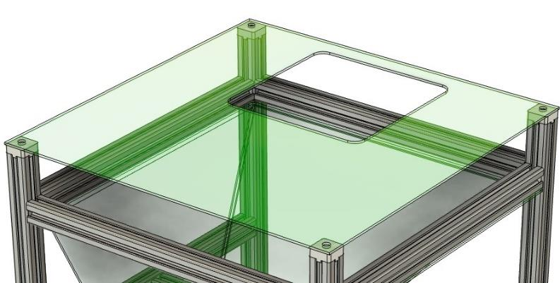
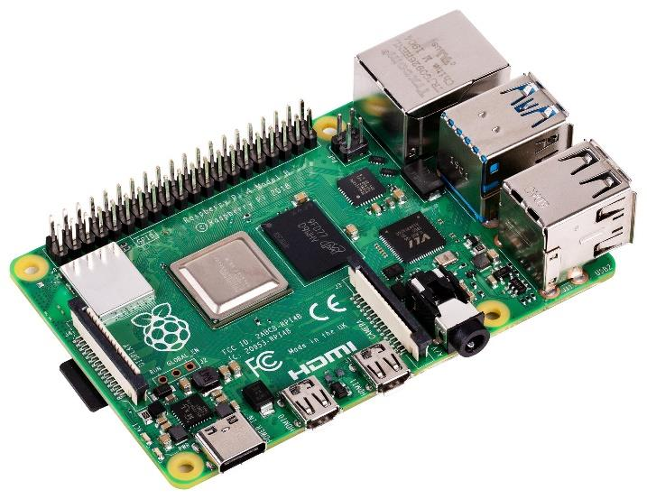
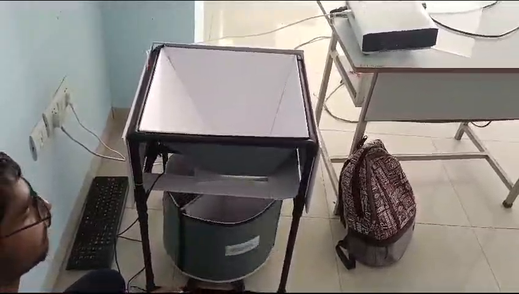
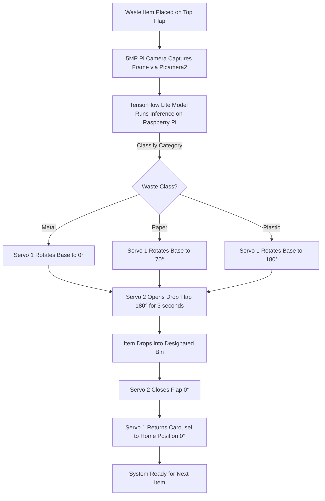
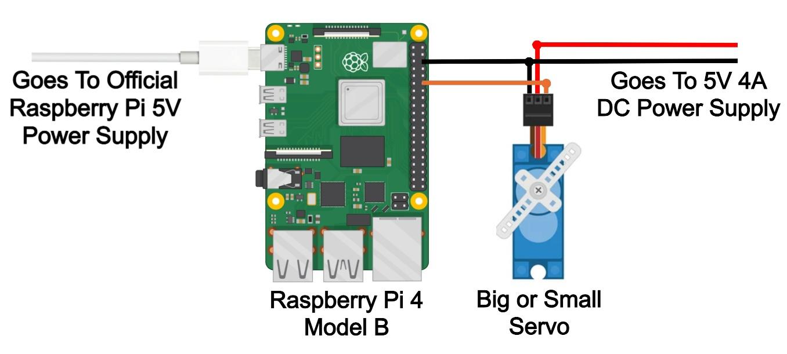

# ♻️ AI-Powered Smart Video Classifying Recycle Bin

[](https://www.raspberrypi.com/)
[](https://www.tensorflow.org/lite)
[](https://colab.research.google.com/)
[](https://python.org)
[](https://thonny.org)
[](LICENSE)

An intelligent, automated waste sorting system built on **Raspberry Pi 4 / 5 Model B**. It captures video from a **5MP Pi Camera (Picamera2)**, classifies waste items (**Metal, Paper, Plastic**) using a **TensorFlow / TensorFlow Lite** model trained and tested on **Google Colab**, and mechanically sorts the waste into segregated bins using dual high-torque **MG996R servo motors**.

---

## 📹 Hardware Demonstration



> 🎥 **Full Video Demo**: Watch the complete hardware prototype in action in [assets/demo.mp4](assets/demo.mp4).

---

## 🛠️ Hardware Photos & Mechanical Design

| Complete Prototype | PVC Frame Structure |
| :---: | :---: |
|  |  |
| **Real Hardware Prototype in Action** | **Rigid PVC Pipe Framework** |

| Inverted Prism Guide Chute | Electronics |
| :---: | :---: |
|  |  |
| **PVC Foam Chute & Acrylic Top Lid** | Raspberry Pi 4/5 model B|

| Plastic Sorting Action |
| :---: | :---: |
|  | 
| **Carousel Rotated to Plastic Compartment** | 

---

## ⚙️ How It Works



1. **Vision Sensing**: When an item is placed on the chute, the **Pi Camera** captures frames using `Picamera2`.
2. **TensorFlow Classification**: The **TensorFlow Lite** model running locally on the Raspberry Pi identifies the object (`metal`, `paper`, or `plastic`).
3. **Carousel Positioning (Servo 1 - GPIO 18)**:
   - `Metal` $\rightarrow$ **0°**
   - `Paper` $\rightarrow$ **70°**
   - `Plastic` $\rightarrow$ **180°**
4. **Dispense Actuation (Servo 2 - GPIO 19)**: The drop flap rotates to **180°** to drop the item into the selected compartment, holds for 3 seconds, and returns to **0°** (closed).
5. **Reset Sequence**: The carousel returns to its home position (`0°`), ready for the next waste item.

---

## 🔌 Circuit Wiring & GPIO Connections



### GPIO Pinout Table

| Component | Pin / Wire | Connected To (Raspberry Pi / PSU) | Description |
| :--- | :--- | :--- | :--- |
| **Servo 1 (Base Carousel)** | Orange (PWM Signal) | **GPIO 18 (Pin 12 / PWM0)** | Rotates compartment base |
| **Servo 1 (Base Carousel)** | Red (VCC) | **External 5V / 6V DC (+)** | High-torque power rail |
| **Servo 1 (Base Carousel)** | Brown (GND) | **External DC (-) & Pi GND** | Common Ground |
| **Servo 2 (Drop Flap)** | Orange (PWM Signal) | **GPIO 19 (Pin 35 / PWM1)** | Opens and closes drop flap |
| **Servo 2 (Drop Flap)** | Red (VCC) | **External 5V / 6V DC (+)** | High-torque power rail |
| **Servo 2 (Drop Flap)** | Brown (GND) | **External DC (-) & Pi GND** | Common Ground |
| **Raspberry Pi Ground** | Ground (GND) | **Pin 6 / 9 / 14 / 39 (GND)** | Connected to External PSU Ground |
| **Pi Camera** | CSI Ribbon Cable | **CSI Port** | 5MP OV5647 Video Stream |

> ⚠️ **Important:** Connect a common ground wire between the Raspberry Pi GND pin and the external servo power supply GND terminal. Do **not** power the MG996R servos directly from the Raspberry Pi 5V pin header to prevent power brownouts.

---

## 🧠 TensorFlow Model Training & Testing on Google Colab

The AI model was created, trained, and tested using **TensorFlow** on **Google Colab**. 

The Jupyter Notebook is available in the repository:
👉 [`notebooks/Waste_Classification_Training_Colab.ipynb`](notebooks/Waste_Classification_Training_Colab.ipynb)

### Colab Pipeline Steps:
1. **Dataset Split**: Downloaded the dataset and generated **Train** (80%) and **Test** (20%) datasets for `metal`, `paper`, and `plastic`.
2. **Data Augmentation**: Applied rotation, zoom, shear, and flip using TensorFlow `ImageDataGenerator`.
3. **Model Training**: Trained a deep learning classifier utilizing **MobileNetV2 Transfer Learning** with categorical cross-entropy loss and Adam optimizer.
4. **Model Testing & Evaluation**: Evaluated accuracy/loss curves, classification report, and confusion matrix on the unseen test dataset.
5. **TFLite Export**: Converted the trained model into a quantized **TensorFlow Lite (`best.tflite`)** file for edge deployment on Raspberry Pi.

---

## 🚀 How to Run on Raspberry Pi

### 1. Clone the Repository
```bash
git clone https://github.com/<your-username>/ai-recycle-bin.git
cd ai-recycle-bin
```

### 2. Install Dependencies
```bash
pip install -r requirements.txt
```

### 3. Run Using Thonny IDE
1. Open **Thonny IDE** on your Raspberry Pi.
2. Open [`main.py`](main.py).
3. Click the **Run Current Script (F5)** button.

### 4. Or Run via Terminal
```bash
python main.py --model best.tflite
```

---

## 📚 Inspiration & References

* **Vision & TFLite Reference**: [Freedom Tech - Raspberry Pi TFLite Object Detection Video Tutorial](https://www.youtube.com/watch?v=3YqbO2AlepM) — used as the starting vision pipeline reference.
* **Custom Engineering & Extensions**:
  * Dual-servo mechanical actuation (Carousel rotation + Drop flap trapdoor).
  * Custom Google Colab TensorFlow dataset generation, model training, and quantization pipeline.
  * Structural design and hardware assembly (PVC frame, acrylic cover, and inverted prism foam chute).

---

## 📄 Project Documentation

The full 55-page formal project report detailing literature survey, hardware design, code explanations, testing, and challenges is available at:
📁 [`docs/AI_Recycle_Bin_Project_Report.pdf`](docs/AI_Recycle_Bin_Project_Report.pdf)

---

## 📜 License

This project is licensed under the [MIT License](LICENSE).
