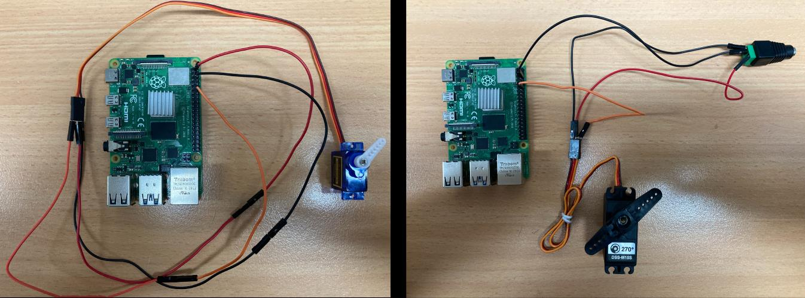

# Bill of Materials (BOM) & Budget

Itemized list of all hardware components, mechanical materials, and electronics used in the **AI-Powered Smart Video Classifying Recycle Bin**.

---

## 1. Electronics & Compute

| # | Item Name | Specification | Quantity | Estimated Cost (INR) |
| :--- | :--- | :--- | :---: | :--- |
| 1 | **Raspberry Pi 4 Model B** | 4GB RAM, Broadcom BCM2711 Quad-Core | 1 | ₹3,400 |
| 2 | **Pi Camera Module** | 5MP OV5647 Sensor, 1080p, CSI interface | 1 | ₹300 |
| 3 | **MicroSD Card** | 32GB Class 10 / UHS-1 SanDisk Ultra | 1 | ₹400 |
| 4 | **Raspberry Pi Power Adapter** | 15W USB-C (5.1V / 3.0A) | 1 | ₹725 |
| 5 | **Micro-HDMI to HDMI Cable** | Male to Male 4K 60Hz Cable | 1 | ₹600 |
| 6 | **External DC Power Supply** | 5V / 6V / 9V (Regulated for Servos) | 1 | ₹1,000 |
| 7 | **Servo Motors (MG 996R)** | High-Torque Metal Gear Digital Servos (10kgf·cm) | 2 | ₹900 (₹450 ea) |
| 8 | **Jumper Wires** | Male-to-Female & Male-to-Male Dupont Wires | 1 Pack | ₹50 |

---

## 2. Mechanical & Structural Components

| # | Item Name | Purpose | Estimated Cost (INR) |
| :--- | :--- | :--- | :--- |
| 9 | **PVC Pipes & Elbow Joints** | Structural outer framework of the bin | ₹650 |
| 10 | **PVC Foam Sheets** | Inverted prism guide chute & internal bins | ₹450 |
| 11 | **Transparent Acrylic Sheets** | Top inspection cover lid & rotating base disc | ₹540 |
| 12 | **Castor Wheels & Magnets** | Smooth base rotation & magnetic bin docking | ₹100 |
| 13 | **Spray Paint** | Protective coating & frame finish | ₹250 |
| 14 | **Miscellaneous Hardware** | Screws, fasteners, glue, bracket mounts, R&D | ₹2,585 |

---

### **Total Project Cost:** `~₹12,000 INR`

---

## 3. Structural Photos

| Frame Structure | Chute & Acrylic Cover |
| :---: | :---: |
|  |  |
| **PVC Pipe Rigid Framework** | **Inverted Prism Foam Chute & Acrylic Disc** |

| Electronics Assembly | 3D CAD Design |
| :---: | :---: |
|  |  |
| **Raspberry Pi & Dual Servos Bench** | **Full 3D Physical Assembly** |
